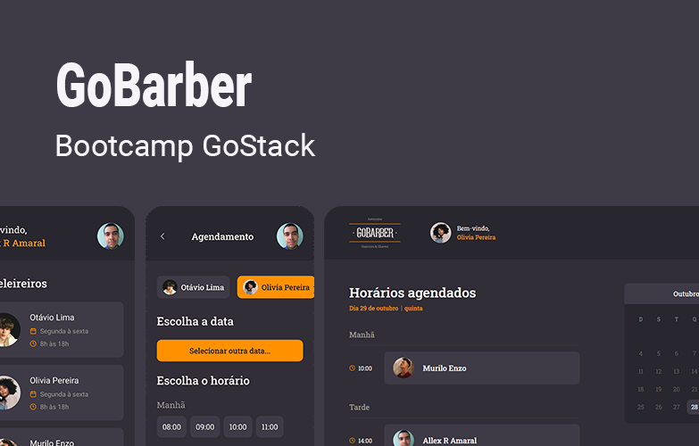

# GoBarber

  

GoBarber é uma plataforma para agendamento de serviços em barbearias. Desenvolvido durante o [Bootcamp GoStack](https://pages.rocketseat.com.br/gostack) 2020 @ [Rocketseat](https://rocketseat.com.br/)

------

## Ambiente de desenvolvimento

- Instale as dependências do projeto com o comando `yarn`;

- Certifique-se de possuir o Docker instalado e funcionando;

- Inicie os containeres com mongodb, redis e postgresql com o comando `docker-compose up -d`;

- Crie um arquivo `.env` seguindo o exemplo `.env.example`. Para as conexões com os bancos de dados, pode-se optar por usar o arquivo `ormconfig.json` também;

- Acesse o postgres rodando no container gobarber_postgres e crie um novo banco de dados chamado `gostack_gobarber`;

- Execute as migrations do typeorm com o comando `yarn typeorm migration:run`

- Inicie o sistema com `yarn dev:server`. Acesse a API com o endereço [http://localhost:3333](http://localhost:3333).

------

## Requisitos do sistema

### Recuperação de senha

*RF*:

- O usuário deve poder recuperar sua senha informando o seu email;
- O usuário deve receber um email com instruções de recuperação de senha;
- O usuário deve poder resetar sua senha;

*RNF*:

- Utilizar Mailtrap para testar envios de email em ambiente de desenvolvimento;
- Utilizar o Amazon SES para envios em produção;
- O envio de email deve acontecer em segundo plano;

*RN*:

- O link enviado por email para resetar senhas deve expirar em 2h;
- O usuário deve confirmar a nova senha ao resetar sua senha;

------

### Atualização do perfil

*RF*:

- O usuário deve poder atualizar seu perfil (nome, email e senha);

*RN*:

- O usuário não pode alterar seu email para um email já utilizado;
- Para atualizar sua senha o usuário deve informar a senha antiga;
- Para atualizar sua senha, o usuário deve confirmar a nova senha;

------

### Painel do prestador

*RF*:

- O usuário deve poder listar seus agendamentos de um dia específico;
- O prestador deve receber uma notificalçai sempre que houver um novo agendamento;
- O prestador deve poder visualizar as notificações não lidas;

*RNF*:

- Os agendamentos do prestador no dia devem ser armazenadas em cache;
- As notificações do prestador devem ser armazenadas no MongoDB;
- AS notificações do prestador devem ser enviados em tempo-real utilizando Socket.io;

*RN*:

- A notificação deve ter um status de lida ou não lida para que o prestador possa controlar;

------

### Agendamento de serviços

*RF*:

- O usuário deve poder listar todos os prestadores de serviço cadastrados;
- O usuário deve poder listar os dias de um mês com pelo menos um horário disponível de um prestador;
- O usuário deve poder listar horários disponíveis em um dia específico de um prestador;
- O usuário deve poder realizar um novo agendamento com um prestador;

*RNF*:

- A listagem de prestadores deve ser armazenada em cache;

*RN*:

- Cada agendamento deve durar 1h;
- Os agendamentos devem estar disponíveis entre as 8h e as 18h (primeiro as 8, último as 17);
- O usuário não pode agendar em um horário já ocupado;
- O usuário não pode agendar um horário que já passou;
- O usuário não pode agendar serviços consigo mesmo;

## Contribuindo

Após realizar suas alterações no código, abra uma pull-request para a branch master. Assim que for aprovada e mergeada, será gerado um novo deploy no [Heroku](https://www.heroku.com/).
